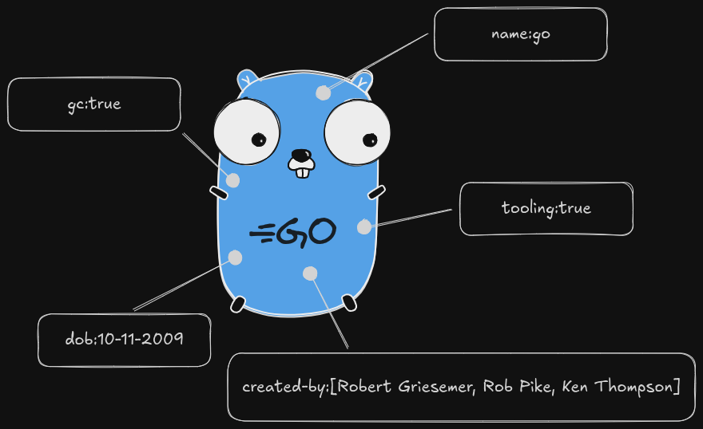
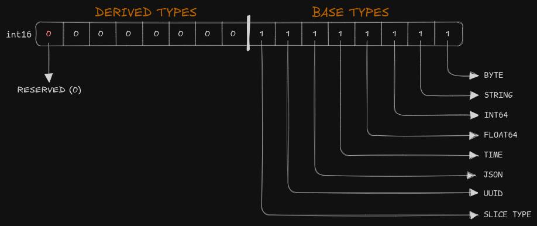
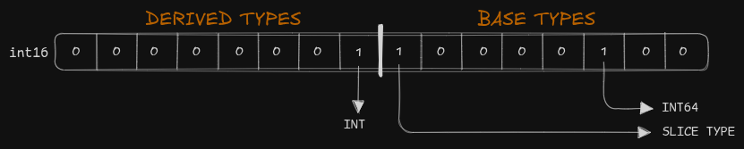
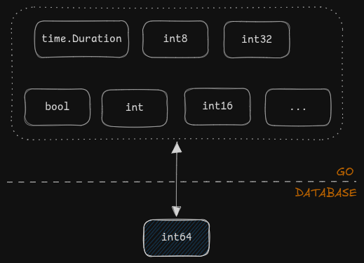

[](https://goreportcard.com/report/github.com/ctx42/nomix)
[](https://pkg.go.dev/github.com/ctx42/nomix)


# nomix: Tagging and Metadata for Go

<!-- TOC -->
* [nomix: Tagging and Metadata for Go](#nomix-tagging-and-metadata-for-go)
  * [Installation](#installation)
  * [Introduction](#introduction)
  * [Base and Derived Types](#base-and-derived-types)
  * [Tag Kind](#tag-kind)
  * [Tag Interface](#tag-interface)
  * [Typed Tags](#typed-tags)
  * [Tag Spec](#tag-spec)
  * [Tag Definition](#tag-definition)
  * [Registry](#registry)
  * [Tag Sets](#tag-sets)
<!-- TOC -->

In the world of software engineering, we often deal with a vast array of assets like files, profiles, products, and so on. These assets form the backbone of application data structures, but as systems grow more complex, simply storing the core data isn't enough. That's where metadata comes into play. Metadata provides a way to add extra layers of information and organization to these assets, making systems more adaptable.

The `nomix` – from *nomos* (law/order) or *nomen* (name) library provides a simple interface to deal with multi type labeled metadata value sets in a generic way. In the context of the module we call them **tags**.

Before explaining the library's API, let's introduce its approach and philosophy.

## Installation
To use `nomix` in your Go project, install it with:

```bash
go get github.com/ctx42/nomix
```

## Introduction
When we talk about tags, we usually think about a set of name-value pairs representing a set of data that describes and gives information about other data.



Using `map[string]any` in Go is a simple way to model this kind of data, but it has several drawbacks:

- Managing `any` values is challenging.
- Comparing `any` values is challenging.
- Restricting `any` to specific supported types is not straightforward.
- Mapping `any` to database types is complex.

We need a more sophisticated solution that is user-friendly for programmers, supports easy definition types and validation rules, and simplifies database storage. To enable efficient searching and indexing of tags, we must limit supported types to those widely available across databases.

## Base and Derived Types
The requirement to limit types to a small, widely supported set across most database engines guided our design. We named these **Base Types** and selected the following seven during the module's design:

- `byte`
- `string`
- `int64`
- `float64`
- `time`
- `JSON`
- `UUID`

In the database layer, the **Base Types** can map to multiple types, termed **Derived Types**, in the application layer. Examples of derived types include:

- `bool`
- `int`
- `uint16`
-  .... and so on

## Tag Kind

Each of the types has assigned the **Type Kind** which is `int16` number.



The lower octet is reserved by the library to hold *base types*, the seven higher bits are for use by a library user to create *derived types*. Notice that there is also a bit indicating *slice type* which allows us to create typed slices (arrays) of the base types.

For example, if we wanted to define `[]int` *derived type* we could do it as follows:



Based on the above idea, we can seamlessly map types from Go to a database.



## Tag Interface

OK we have the basis of the module explained. Building on it we define the main `nomix` interface:
```go
// Tag is an interface representing a tag.
//
// Tags are named and typed values that can be used to annotate objects.
type Tag interface {
	// TagName returns tag name.
	TagName() string

	// TagKind returns the [Kind] holding the information about the type of
	// the tag value. Use it to interpret the value returned by the
	// [Tag.TagValue] method.
	TagKind() Kind

	// TagValue returns tag value.
	// You may use the value returned by the [Tag.TagKind] method
	// to cast it to the proper type.
	TagValue() any
}
```

The `Tag` interface is implemented by all the **Named** and **Typed Tags**. It still has the `any` returned from the `TagValue` method, but we need it if we want to be able to handle tag sets with all the supported *base types* and `derived types` by the same interface.

## Typed Tags

To create typed tags the `nomix` package provides generic `Single` and `Slice` types which both implement the `Tag` interface and in the same time provide typed methods to access their typed values.

```go
// Single is a generic type for single value [Tag].
type Single[T comparable] struct { ... }

// Slice is a generic type for multi value [Tag].
type Slice[T comparable] struct { ... }
```

Both of the types have constructor functions (`NewSingle` and `NewSlice`) to create the instances.

Lets say we would like to define an `int` *derived type* based on `int64` *base type* and its constructor function.

```go
// Int is a tag representing a single integer value.
type Int = nomix.Single[int]

// NewInt returns a new instance of [Int].
func NewInt(name string, val int) *Int {
	return nomix.NewSingle(name, val, nomix.KindInt, strconv.Itoa, sqlValueInt)
}

// sqlValueInt converts int to its int64 representation. Never returns an error.
func sqlValueInt(val int) (driver.Value, error) { return int64(val), nil }
```

That's it. The `nomix.NewSingle` is the `nomix.Single[T comparable]` constructor function which you call defining the tag name, value, kind, a function that returns the string representation of the *derived type* and a function returning `driver.Value` for it.

You can see the full implementation of `Int` and many other base and derived types in `xtag` package.
## Tag Spec
The `TagSpec` is a structure providing tag kind specification, it puts together the `TagKind` and `TagCreateFunc` and `TagParseFunc` functions which create tags of given *kind* and parse tags of that kind from strings respectively. The functions have signatures:

```go
// TagCreateFunc function signature for creating [Tag] instances.
type TagCreateFunc func(name string, val any, opts ...Option) (Tag, error)

// TagParseFunc function signature for creating [Tag] instances from their
// string representation.
type TagParseFunc func(name, val string, opts ...Option) (Tag, error)
```

the *spec* for previously seen `Int` tag looks like this:

```go
spec := nomix.NewKindSpec(
    nomix.KindInt,
    nomix.CreateFunc(xtag.CreateInt),
    nomix.ParseFunc(xtag.ParseInt),
)

tagA, errA := spec.TagCreate("A", 42)
tagB, errB := spec.TagParse("B", "42")

fmt.Printf("- A: %v err: %v\n", tagA.TagValue(), errA)
fmt.Printf("- B: %v err: %v\n", tagB.TagValue(), errB)
// Output:
// - A: 42 err: <nil>
// - B: 42 err: <nil>
```

The `TagSpec` main job is to simplify creation of tags for given *base* or *derived* types.

## Tag Definition

The `Definition` defines named tag using `KindSpec` and optionally set of [validation rules](https://github.com/ctx42/verax).

```go
def := nomix.Define("name", xtag.IntSpec(), verax.Max(42))

tag, err := def.TagCreate(42)
fmt.Printf("- success: %s err: %v\n", tag, err)

tag, err = def.TagCreate(44)
fmt.Printf("- failure: %v err: %v\n", tag, err)

// Output:
// - success: 42 err: <nil>
// - failure: <nil> err: name: must be no greater than 42
```

With `Definition` you can create definitions for tags you are using in your system along with their validation and then use it to create instances of the tags.

## Registry

The `Registry` allows you to register *specs* (for *kinds*) and then associate Go types with them.

```go
reg := nomix.NewRegistry()

_ = reg.Register(xtag.IntSpec())       // Register spec.
_, _ = reg.Associate(0, nomix.KindInt) // Associate the int type with spec.

spec := reg.SpecForKind(nomix.KindInt) // Get spec for KindInt.
tag, err := spec.TagCreate("A", 42)
format := "name: %s; kind: %s; value: %v; err: %v\n"
fmt.Printf(format, tag.TagName(), tag.TagKind(), tag.TagValue(), err)

spec = reg.SpecForType(0) // Get spec for int type.
tag, err = spec.TagCreate("B", 44)
fmt.Printf(format, tag.TagName(), tag.TagKind(), tag.TagValue(), err)

// Convenience function to create tags for registered types.
tag, err = reg.Create("C", 11)
fmt.Printf(format, tag.TagName(), tag.TagKind(), tag.TagValue(), err)

// Output:
// name: A; kind: KindInt; value: 42; err: <nil>
// name: B; kind: KindInt; value: 44; err: <nil>
// name: C; kind: KindInt; value: 11; err: <nil>
```

The `nomix` package also provides a global registry if you wish to register all your specs and types in for example `init` function.

```go
reg := nomix.GlobalRegistry()
```
## Tag Sets
The `nomix.TagSet` is a structure helping to operate on sets of typed tags.

```go
set := NewTagSet() // The map[string]Tag type.

set.TagSet(
    xtag.NewInt("A", 42),
    xtag.NewBool("B", true),
    xtag.NewString("C", "foo"),
)

fmt.Printf("There are %d tags in the set:\n", set.TagCount())
fmt.Printf("- A: %v\n", set.TagGet("A").TagValue())
fmt.Printf("- B: %v\n", set.TagGet("B").TagValue())
fmt.Printf("- C: %v\n", set.TagGet("C").TagValue())
fmt.Printf("- D: %v\n", set.TagGet("D"))

// Output:
// There are 3 tags in the set:
// - A: 42
// - B: true
// - C: foo
// - D: <nil>
```

and untyped tags.

```go
set := NewMetaSet() // The map[string]any type.

set.MetaSet("A", 42)
set.MetaSet("B", true)
set.MetaSet("C", "foo")

fmt.Printf("There are %d entries in the set:\n", set.MetaCount())
fmt.Printf("- A: %v\n", set.MetaGet("A"))
fmt.Printf("- B: %v\n", set.MetaGet("B"))
fmt.Printf("- C: %v\n", set.MetaGet("C"))
fmt.Printf("- D: %v\n", set.MetaGet("D"))

// Output:
// There are 3 entries in the set:
// - A: 42
// - B: true
// - C: foo
// - D: <nil>
```
For convenience the `xtag` package provides *specs*, and *typed tags* for most used types:

- `String` and `StringSlice`
- `Int64` and `Int64Slice`
- `Float64` and `Float64Slice`
- `Time` and `TimeSlice`
- `Bool` and `BoolSlice`
- `Int` and `IntSlice`
- `ByteSlice`